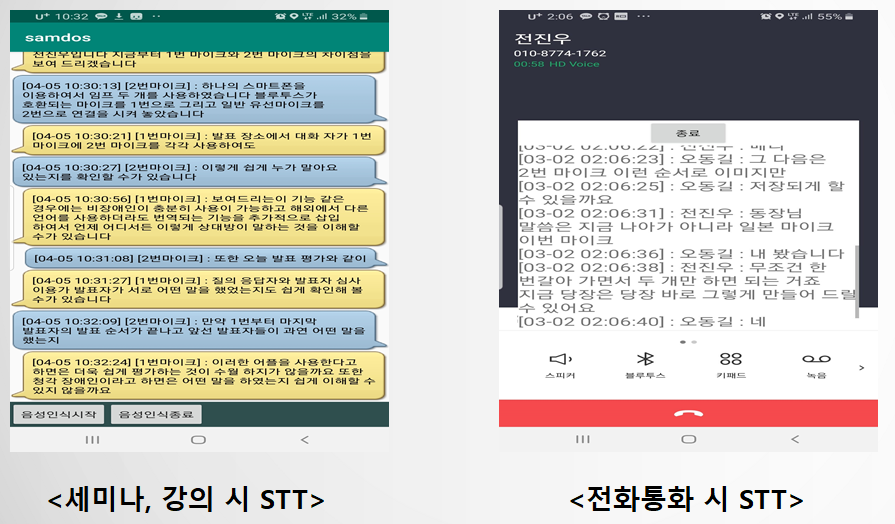

# 갓도 삼도스

## 아날로그 및 디지털 음성 전화통화 내용 TEXT 전환 S/W

* 대화 혹은 음성전화등을 진행할 때 어떤 내용이 있었는지 이해하기가 어렵거나 녹음 파일을 들을 때 장시간의 시간을 소모하는 불편함을 해소하고자 별도의 디바이스 없이 본인의 스마트폰을 사용해 음성 데이터를 텍스트로 전환하여 제공해 소비자들이 느끼는 불편함을 해결하고자 한다.

## UI

## 구성도

## 어플실행

1. 음성 녹음 및 재생

    

위 코드를 이용하여 녹음 API(MediaRecorder)를 실행하며 아래의 코드를 통해 녹음과 재생을 설정한다.

    

해당 녹음기능의 결과는 아래와 같다.

        

버튼을 통해 설정하며 녹음된 음성은 일정 디렉토리에 저장되게 된다.

​    

2. 음성 인식 후 텍스트화(STT)

    

위 코드를 통해 음성인식 후 결과를 보여주게 된다. speechRecognizer API를 통해 음성인식하며 인식한 결과를 리스트에 모은 후 가장 정확도가 높은 결과를 텍스트로 표시한다. 그 후 다음 음성인식을 위해 API를 재가동한다.

인식한 음성내용 저장

    

위 코드는 speechRecognizer API를 이용해 인식한 음성정보를 텍스트화 하여 안드로이드 내부 저장공간에 저장하도록 한다. 저장위치는 지정한 파일이며 매 시간마다 새로운 텍스트파일을 생성하여 저장한다.

​    

실제 사용결과는 다음과 같다.

​    

        

4. 저장된 텍스트 내용 불러오기(TTS)

    

위 코드는 TextToSpeech API를 이용하여 입력된 텍스트를 기계음성으로 바꾸어주는 역할을 한다.

